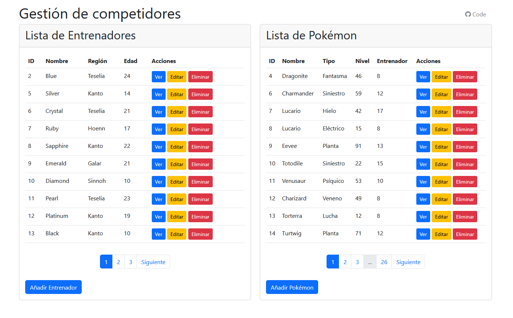
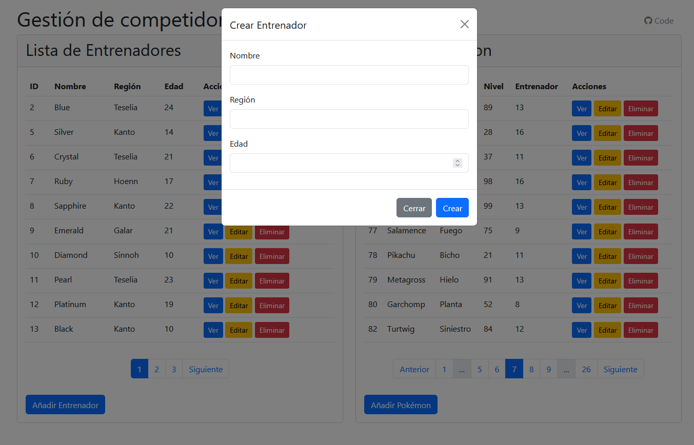
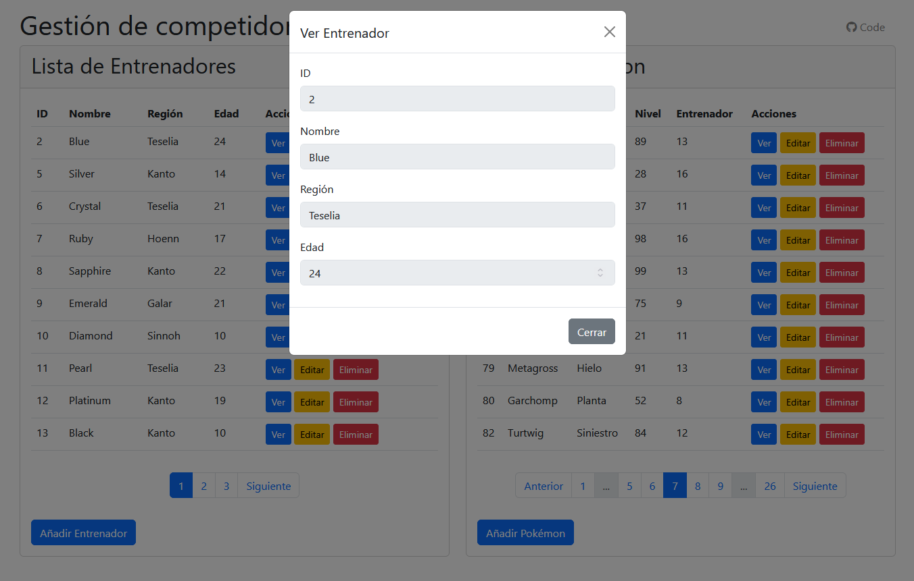
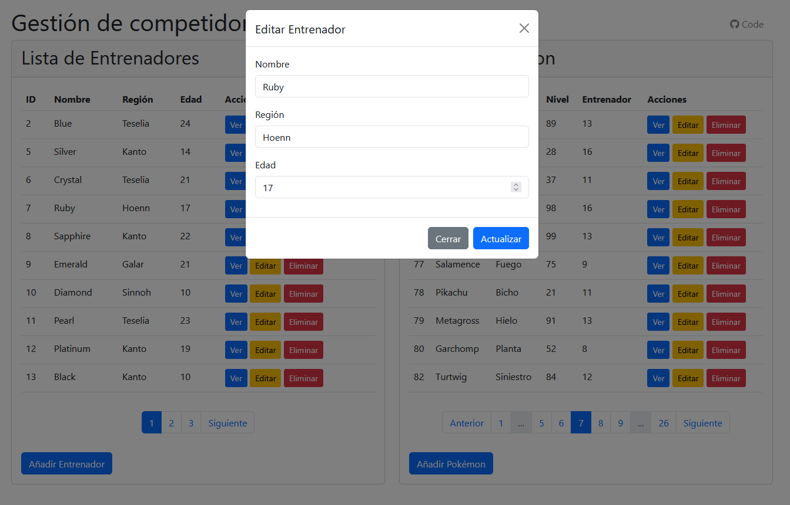
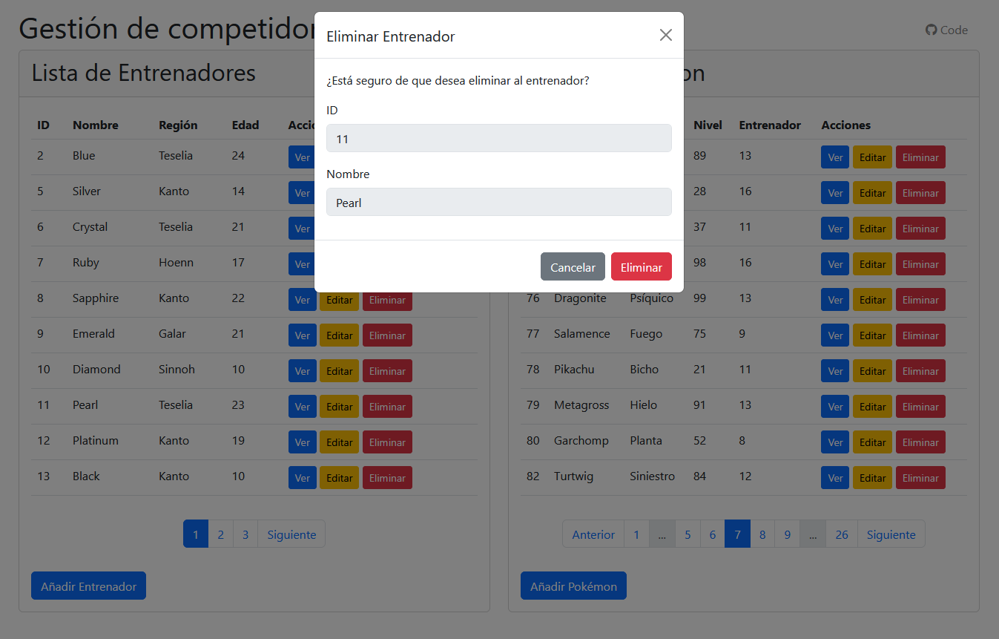
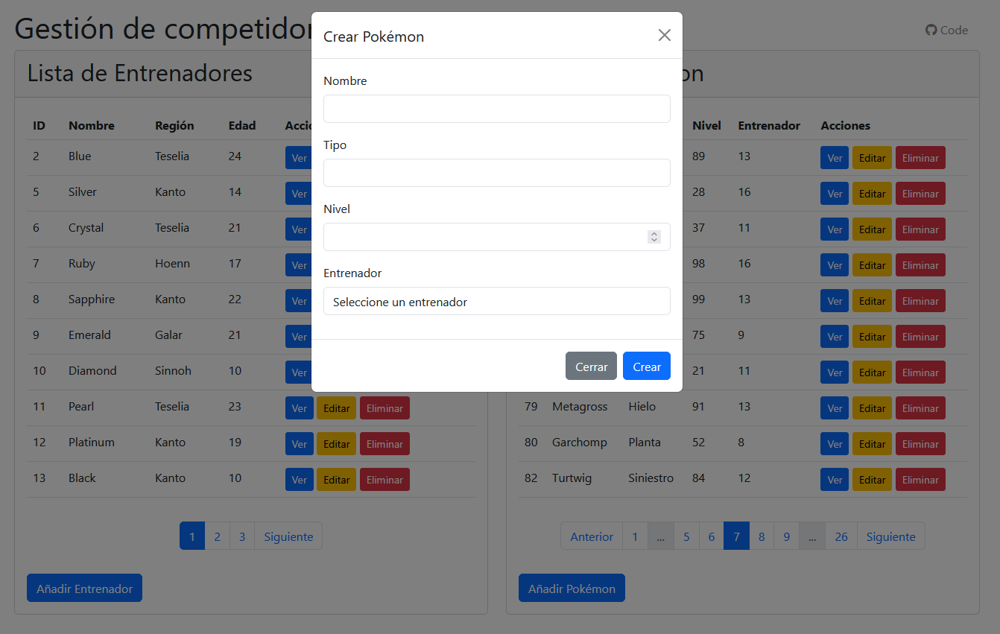
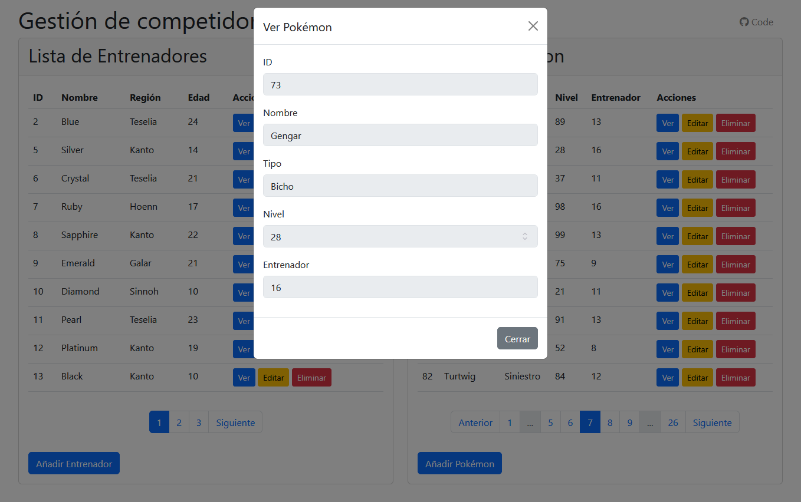
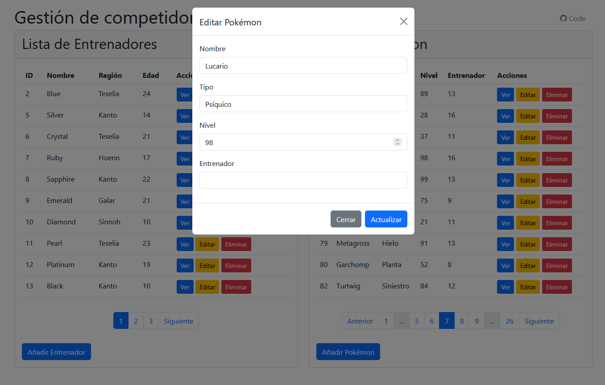
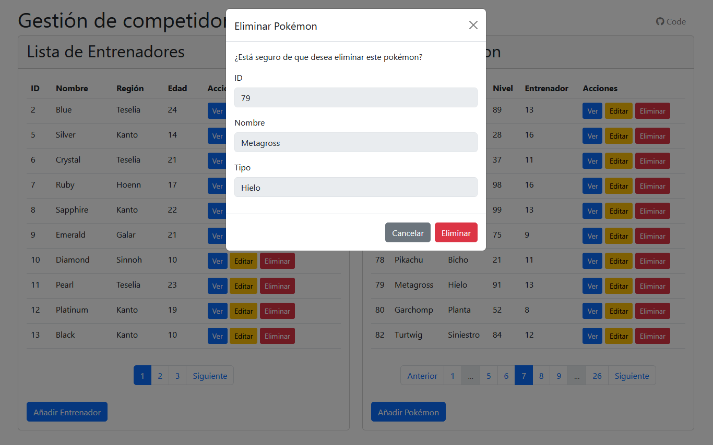

## Proyecto Fetch_App

### Instalación
1. Clona el repositorio:
    ```bash
    git clone https://github.com/rtro-dev/Fetch_App.git
    cd Fetch_App
    ```

2. Configura los permisos:
    ```bash
    sudo chown -R user:www-data Fetch_App/
    sudo chmod -R 775 Fetch_App/
    ```

3. Instala las dependencias de PHP:
    ```bash
    composer install
    ```

4. Crea el archivo de entorno `.env`:
    ```bash
    cp .env.example .env
    php artisan key:generate
    ```

5. Configura la base de datos en el archivo `.env`.

6. Ejecuta las migraciones:
    ```bash
    php artisan make:migration create_trainers_table
    php artisan make:migration create_pokemon_table
    php artisan migrate
    ```

### Generación de Modelos y Controladores
1. Crea los modelos:
    ```bash
    php artisan make:model Trainer
    php artisan make:model Pokemon
    ```

2. Crea los controladores:
    ```bash
    php artisan make:controller TrainerController --resource
    php artisan make:controller PokemonController --resource
    ```

### Validación con Form Requests
Los Form Requests son clases dedicadas a la validación de datos que permiten mover la lógica de validación fuera de los controladores. Esto hace que el código sea más limpio y mantenible. Sirven para:
- Separación de responsabilidades: Permiten mover la lógica de validación fuera de los controladores.
- Reutilización: Las reglas de validación pueden reutilizarse en diferentes partes de la aplicación.
- Autorización: Incluyen un método authorize() que permite definir si el usuario tiene permiso para realizar la acción.
- Mensajes personalizados: Permiten definir mensajes de error específicos para cada regla de validación.
- Validación compleja: Pueden contener lógica de validación más compleja y personalizada.

En este proyecto se ha simplificado la validación en los controladores de la siguiente forma:
- Se ha eliminado la validación manual con `$request->validate()`
- Se usa `$request->validated()` que devuelve los datos ya validados

Para crear los Form Requests:
```bash
php artisan make:request StoreTrainerRequest
php artisan make:request UpdateTrainerRequest
php artisan make:request StorePokemonRequest
php artisan make:request UpdatePokemonRequest
```
- **StoreTrainerRequest**: Valida creación de entrenadores
- **UpdateTrainerRequest**: Valida actualización de entrenadores
- **StorePokemonRequest**: Valida creación de pokémon
- **UpdatePokemonRequest**: Valida actualización de pokémon

Cada Form Request contiene reglas específicas y mensajes de error personalizados para garantizar la integridad de los datos.

### Rutas
Se crean las rutas y se verifican con:
```bash
php artisan route:list
```

Las rutas de recursos `Route::resource()` contienen todos los tipos de peticiones (GET, POST, PUT y DELETE).

### El script con fetch
Se crea el script con una estructura modular para mantener el código limpio y reutilizable.

El archivo principal está en `public/assets/js/app.js`  
La clase `PokemonManager` está en `public/assets/js/modules/PokemonManager.js`  
Los ficheros de configuración están en `public/assets/js/config/` con los nombres `pokemon-types.js` y `regions.js`.

Se incluyen los scripts en el layout principal `app.blade.php` al final del `<body>`:
```html
<script type="module" src="{{ asset('assets/js/app.js') }}"></script>
```

#### Controladores
Los controladores manejan la lógica principal de la aplicación:

- **TrainerController**: Gestiona las operaciones CRUD para entrenadores
    - `apiIndex`: Lista paginada de entrenadores
    - `apiShow`: Muestra un entrenador específico
    - `apiStore`: Crea un nuevo entrenador
    - `apiUpdate`: Actualiza un entrenador existente
    - `apiDestroy`: Elimina un entrenador y sus pokémon asociados

- **PokemonController**: Gestiona las operaciones CRUD para pokémon
    - `apiIndex`: Lista paginada de pokémon
    - `apiShow`: Muestra un pokémon específico
    - `apiStore`: Crea un nuevo pokémon
    - `apiUpdate`: Actualiza un pokémon existente
    - `apiDestroy`: Elimina un pokémon

#### Rutas API
Las rutas API se encuentran en `routes/web.php`:

```php
// API Routes de Entrenadores
Route::post('/api/trainers', [TrainerController::class, 'apiStore']);
Route::get('/api/trainers', [TrainerController::class, 'apiIndex']);
Route::get('/api/trainers/{trainer}', [TrainerController::class, 'apiShow']);
Route::put('/api/trainers/{trainer}', [TrainerController::class, 'apiUpdate']);
Route::delete('/api/trainers/{trainer}', [TrainerController::class, 'apiDestroy']);

// API Routes de Pokemon
Route::post('/api/pokemon', [PokemonController::class, 'apiStore']);
Route::get('/api/pokemon', [PokemonController::class, 'apiIndex']);
Route::get('/api/pokemon/{pokemon}', [PokemonController::class, 'apiShow']);
Route::put('/api/pokemon/{pokemon}', [PokemonController::class, 'apiUpdate']);
Route::delete('/api/pokemon/{pokemon}', [PokemonController::class, 'apiDestroy']);
```

#### Vistas
El proyecto utiliza un sistema de modales para las operaciones CRUD:

- **Entrenadores**:
    - Modal de creación: Formulario para nuevo entrenador
    - Modal de edición: Formulario para modificar entrenador
    - Modal de visualización: Muestra detalles del entrenador
    - Modal de eliminación: Confirma eliminación del entrenador

- **Pokémon**:
    - Modal de creación: Formulario para nuevo pokémon
    - Modal de edición: Formulario para modificar pokémon
    - Modal de visualización: Muestra detalles del pokémon
    - Modal de eliminación: Confirma eliminación del pokémon

#### JavaScript
Los archivos JavaScript gestionan las operaciones asíncronas:

- **trainer.js**: Funciones para gestionar entrenadores
    - `loadTrainers`: Carga lista paginada
    - `viewTrainer`: Muestra detalles
    - `editTrainer`: Prepara edición
    - `updateTrainer`: Actualiza datos
    - `deleteTrainer`: Prepara eliminación
    - `confirmDeleteTrainer`: Confirma eliminación

- **pokemon.js**: Funciones para gestionar pokémon
    - `loadPokemon`: Carga lista paginada
    - `viewPokemon`: Muestra detalles
    - `editPokemon`: Prepara edición
    - `updatePokemon`: Actualiza datos
    - `deletePokemon`: Prepara eliminación
    - `confirmDeletePokemon`: Confirma eliminación

### Imágenes
Las imágenes del proyecto muestran la interfaz de usuario:









